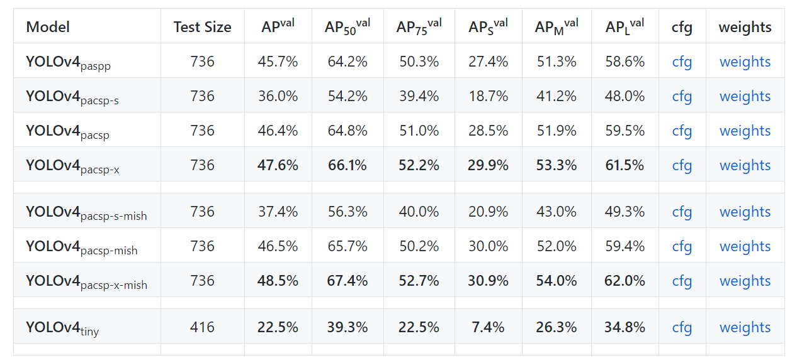
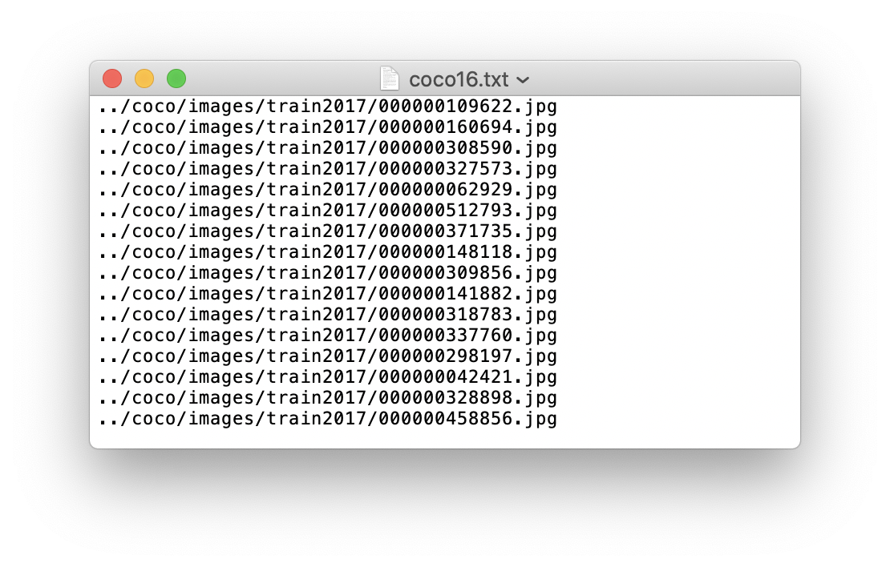
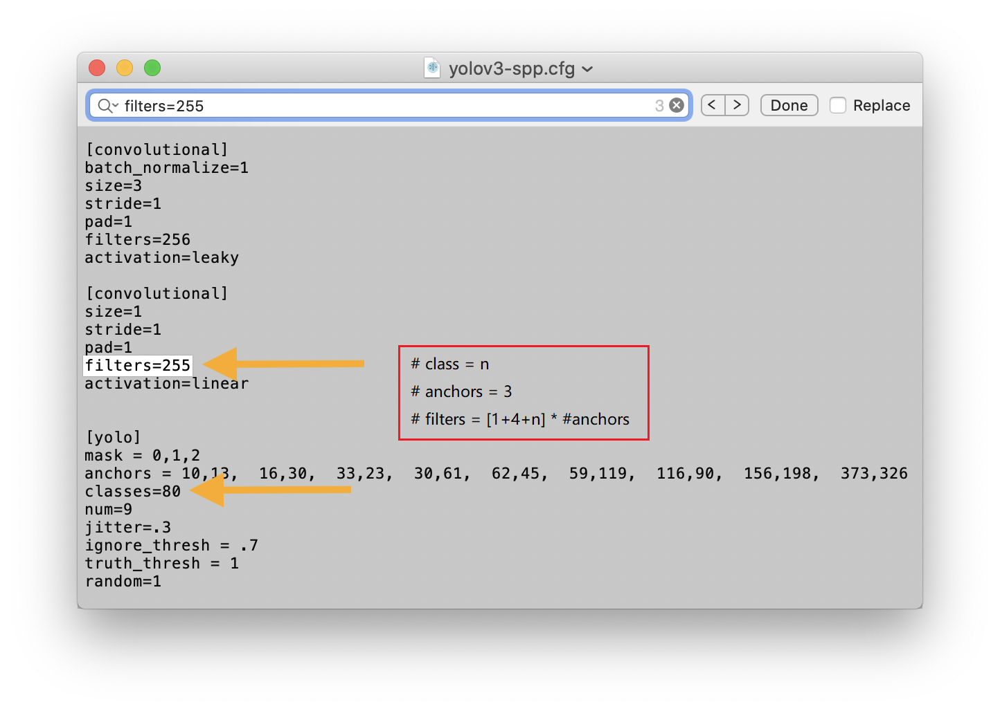
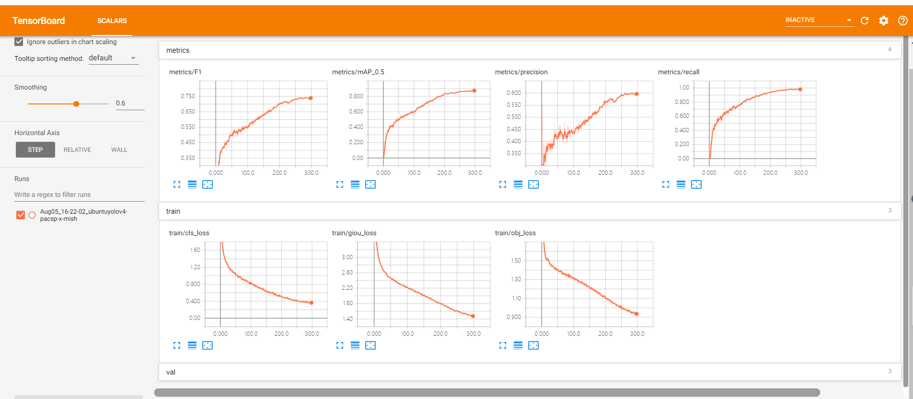
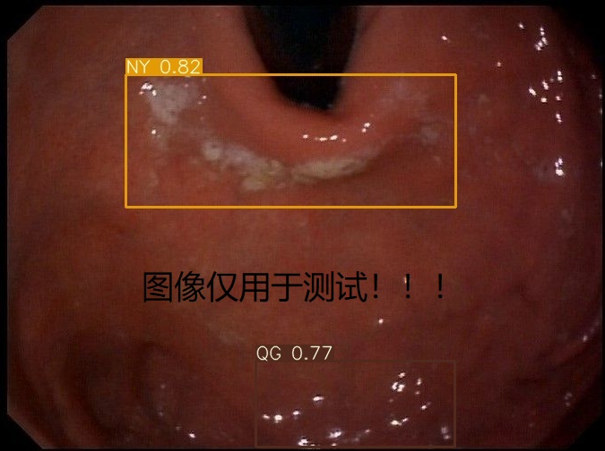
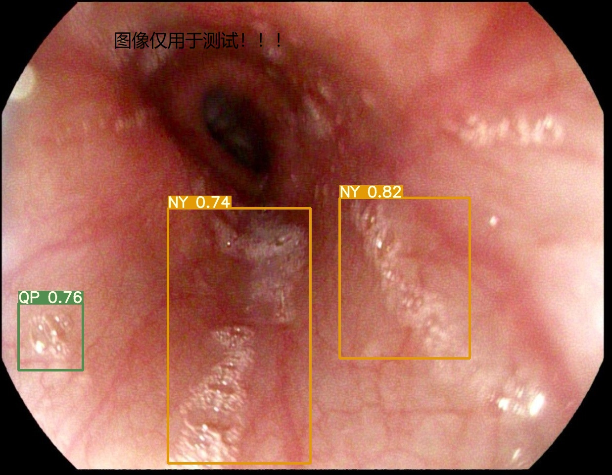

## [Pytorch-YOLO v4](https://github.com/WongKinYiu/PyTorch_YOLOv4)训练自己的数据集

该版本的复现者是YOLOv4的二作：**Chien-Yao Wang**，他也是CSPNet的一作。再值得说的是YOLOv4 和 YOLOv5都用到了CSPNet。 这个PyTorch版本的YOLOv4是基于 ultralytic的YOLOv3基础上实现的。ultralytic 复现的YOLOv3 应该最强的YOLOv3 PyTorch复现：https://github.com/ultralytics/yolov3。我们将使用该本本的YOLO v4训练自己的数据集，并提供详细的代码修改和训练，测试的整个过程。



### 1.数据准备

数据集的构建参考<https://github.com/ultralytics/yolov3/wiki/Train-Custom-Data>


**1. 将数据转化为darknet fromat.** 

使用LabelImg或Labelbox标注后的数据后，需要将数据转化为darknet format. 其中images和labels需要放在同级的两个文件夹下，每一个image对应一个label标注文件（如果该图像没有标注，则没有标注文件对应），标注文件满足：

+ 一个标注box对应一行
+ 每行内容： class, x_center,y_center, width,height
+ Box的坐标时标准化后的（0-1）
+ class的index从0开始

每一个image和label文件的存放满足如下的关系

```
../coco/images/train2017/000000109622.jpg  # image
../coco/labels/train2017/000000109622.txt  # label
```

这是一个label文件的例子，包含5个person(class=0)的类别:


**2. 创建 train 和 test \*.txt 文件.**

存放了train和test的图像的路径，例如：



**3. 创建新的 \*.names 文件**

存放了类别名称，例如新建`myData.names`(3个类别)

```
class_1
class_2
class_3
```

**4. 创建 新的 \*.data 文件** 

新建`myData.data`

```
classes=3
train=data/myData/myData_train.txt
valid=data/myData/myData_val.txt
names=data/myData.names
```


### 2.环境安装

需要的安装环境

```
numpy == 1.17
opencv-python >= 4.1
torch==1.3.0
torchvision==0.4.1
matplotlib
pycocotools
tqdm
pillow
tensorboard >= 1.14
```
※ 运行Mish model需要安装 https://github.com/thomasbrandon/mish-cuda

```
sudo pip3 install git+https://github.com/thomasbrandon/mish-cuda.git
```


### 3.模型配置文件修改

配置文件的修改个darknet版本的YOLO v3和YOLO v4是相同的，可以参考其进行修改，主要包括了一些超参数和网络的参数。



### 4.预训练模型下载

预训练模型的下载：

baidu链接：https://pan.baidu.com/s/1nyQlH-GHrmddCEkuv-VmAg
提取码：78bg


### 5.模型训练

```
python3 train.py --data data/myData.data --cfg cfg/wei_score/yolov4-pacsp-x-mish.cfg --weights './weights/yolov4-pacsp-x-mish.pt' --name yolov4-pacsp-x-mish --img 640 640 640
```


### 6.模型推断

**1.在验证集上的性能测试**

```shell
python3 test_half.py --data data/myData.data\
	--cfg cfg/wei_score/yolov4-pacsp-x-mish.cfg\
    --weights weights/best_yolov4-pacsp-x-mish.pt\
    --img 640\
    --iou-thr 0.6\
    --conf-thres 0.5\
    --batch-size 1
```

```shell
python3 test.py --data data/myData.data\
	--cfg cfg/wei_score/yolov4-pacsp-x-mish.cfg\
	--weights weights/best_yolov4-pacsp-x-mish.pt\
	--img 640\
	--iou-thr 0.6\
	--conf-thres 0.5\
	--batch-size 1
```

```shell
Model Summary: 408 layers, 9.92329e+07 parameters, 9.92329e+07 gradients
Fusing layers...
Model Summary: 274 layers, 9.91849e+07 parameters, 9.91849e+07 gradients
Caching labels (285 found, 0 missing, 0 empty, 0 duplicate, for 285 images): 100%|███████████████████████████████████████| 285/285 [00:00<00:00, 8858.32it/s]
               Class    Images   Targets         P         R   mAP@0.5        F1: 100%|████████████████████████████████████| 285/285 [00:17<00:00, 16.44it/s]
                 all       285       645     0.847      0.66     0.623      0.74
                  QP       285       175     0.856     0.611     0.586     0.713
                  NY       285       289     0.894     0.671     0.647     0.767
                  QG       285       181     0.792     0.696     0.638     0.741
Speed: 23.4/1.1/24.5 ms inference/NMS/total per 640x640 image at batch-size 1

```

**2.单张图片或视频的推断**

```shell
python3 detect.py --cfg cfg/wei_score/yolov4-pacsp-x-mish.cfg\
	--names data/myData.names\
	--weights weights/best_yolov4-pacsp-x-mish.pt\
	--source data/myData/score/images/val\  
	--img-size 640\
	--conf-thres 0.3\
	--iou-thres  0.2\
	--device 0 

```


```shell
tensorboard --logdir=runs
```



### 7.DEMO展示





### 8.TensorRT加速推断

**TODO**

